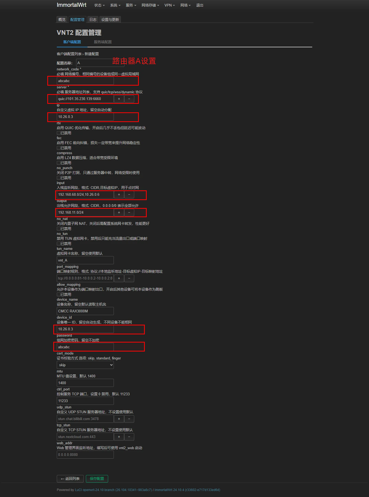
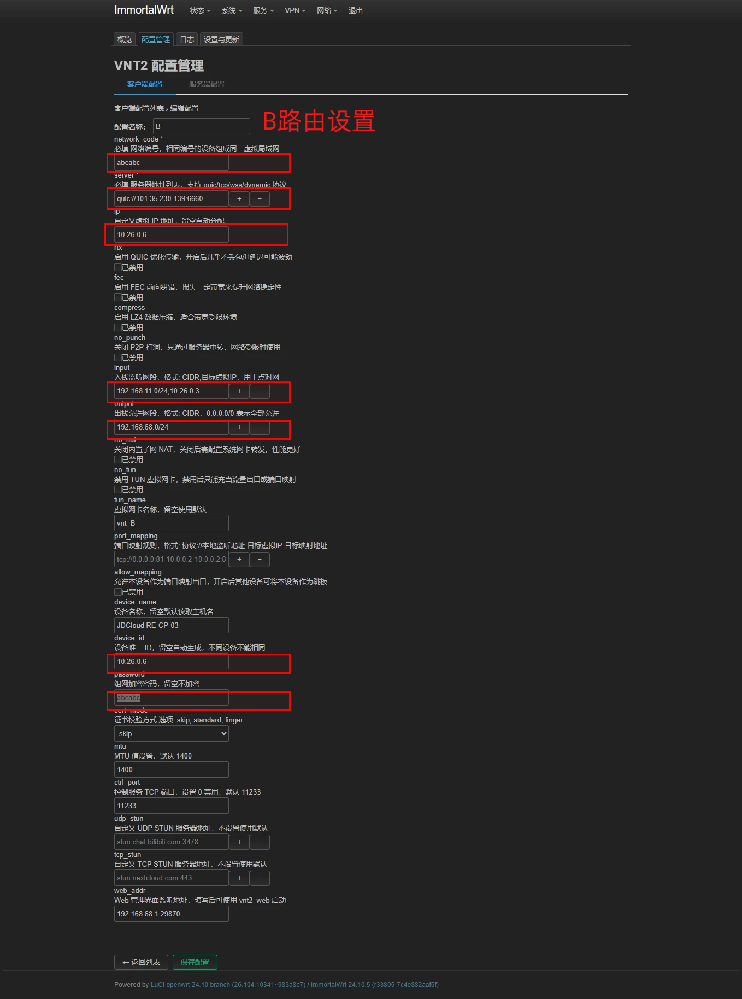
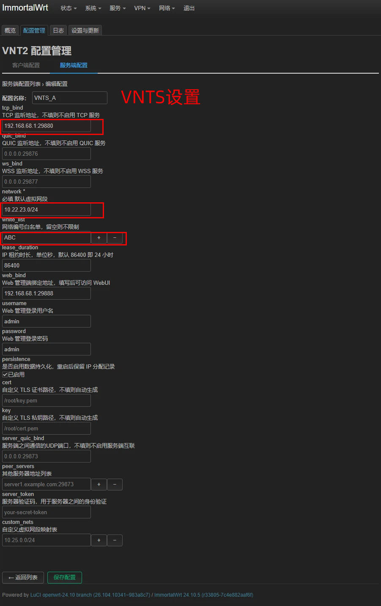
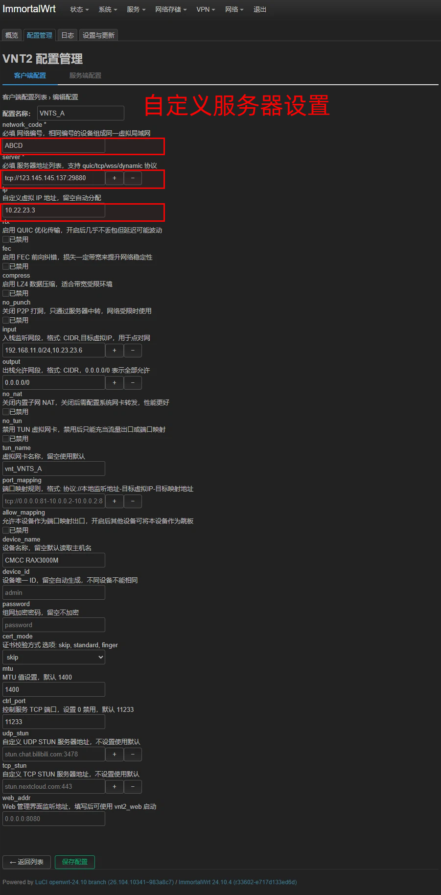

# VNT 2.0 VNTS 2.0 Networking Tutorial

## 1. Install luci-app-vnt2

### Quick Installation (run in terminal)

```bash
curl -fsSL "https://gitlab.com/whzhni/tailscale/-/raw/main/Auto_Install_Script.sh" | sh -s luci-app-vnt2
```

or

```bash
wget -q -O - "https://gitlab.com/whzhni/tailscale/-/raw/main/Auto_Install_Script.sh" | sh -s luci-app-vnt2
```

### Manual Installation

Download the IPK file for your architecture:

- GitHub Releases: https://github.com/whzhni1/luci-app-vnt2/releases
- Mainland China users (without proxy/VPN access): https://gitee.com/whzhni/luci-app-vnt2/releases
- GitLab backup: https://gitlab.com/whzhni/luci-app-vnt2/-/releases

> When installing luci-app-vnt2, it will automatically download `vnt`, `vnts`, and related files. In some regions, downloads may fail due to network conditions. You can follow the instructions on the luci-app-vnt2 homepage to set a mirror source, then download from the "Update Interface".

---

## 2. A/B Router Networking Example

Assume:

- **Router A** LAN address: `192.168.11.1`
- **Router B** LAN address: `192.168.68.1`

Goal: Allow devices on both LANs to access each other.

---

## 3. VNT Client Configuration Tutorial

Path: `luci-app-vnt2` → Configuration Management → Client Configuration → New Configuration

### Common Configuration Items (same for Routers A and B)

| Item | Description |
| ---- | ----------- |
| Configuration Name | Any name (for example, use `A` for Router A and `B` for Router B to distinguish them) |
| Network ID | **Must be the same for Routers A and B** |
| Server Address | Official server: `quic://101.35.230.139:6660` or your self-hosted server address (see below) |
| Custom Virtual IP Address | Router A: `10.26.0.3`, Router B: `10.26.0.6` (you can plan these yourself) |
| Inbound Listening Subnets | Router A: enter Router B's LAN segment: `192.168.68.0/24,10.26.0.6`<br>Router B: enter Router A's LAN segment: `192.168.11.0/24,10.26.0.3` |
| Outbound Allowed Subnets | Local LAN segment (e.g., Router A `192.168.11.0/24`, Router B `192.168.68.0/24`); you can also enter `0.0.0.0/0` to allow all |
| Virtual NIC Name | Leave blank to auto-generate |
| Device Name | Leave blank to auto-detect |
| Unique Device ID | Recommended for Router A: `10.26.0.3`, Router B: `10.26.0.6` (can be customized but must be unique) |
| Networking Encryption Password | **Must be the same for Routers A and B**; recommended to set |
| Web Management Interface Listening Address | Local device LAN address:port (e.g., Router A `192.168.11.1:29870`); using the same port for multiple configurations is prohibited |

### Save and Apply

1. Click **Save Configuration** at the bottom
2. Check the configuration you just created
3. Click **Save & Apply**

> Reference images:
> 
> 

---

## 4. VNT Server Configuration (Self-Hosted Server, Requires a Public IP)

Path: `luci-app-vnt2` → Configuration Management → Server Configuration → New Configuration

### Configuration Item Description

| Item | Example Value | Description |
| ---- | ------------- | ----------- |
| Configuration Name | Any (e.g., `my_vnts`) | |
| TCP Listening Address | `192.168.68.1:29880` | At least one of TCP / QUIC / WSS must be configured |
| QUIC Listening Address | Optional; leave blank to disable | |
| WSS Listening Address | Optional; leave blank to disable | |
| Default Virtual Subnet | `10.22.23.0/24` | Customizable |
| Network Whitelist | Recommended to fill in (e.g., `whzhni`) | Leave blank for no restriction |
| Web Management Address | `192.168.68.1:29888` | Used for the web management interface |
| Web Management Login Username | Custom (e.g., `admin`) | |
| Web Management Login Password | Custom (e.g., `admin`) | |

### Save and Apply

1. Click **Save Configuration** at the bottom
2. Check the configuration you just created
3. Click **Save & Apply**

> Reference image: 

---

## 5. Connecting the Client to a Self-Hosted Server

This is basically the same as "Client Configuration". The only difference is that **Server Address** should be the public address of your self-hosted server.

### Format Description

| Protocol Enabled on Server | Client `server` Format |
| -------------------------- | ---------------------- |
| TCP | `tcp://your-public-IP:port` |
| QUIC | `quic://your-public-IP:port` |
| WSS | `wss://your-domain:port` (TLS certificate required) |

> It is recommended to use a domain name resolved via DNS. DDNS configuration is not covered here.

### Reference Images

- 

---

## 6. FAQ

- **Multiple Server Addresses**: It is recommended to create multiple instances, with one server address per instance. Do not enter multiple addresses in a single configuration; otherwise, if one server goes down, the connection may fail.
- **Web Management Port Conflict**: The web management port of each instance must be unique.
- **Self-Hosted Server Port Conflicts**: Ports for each instance must not be the same. Within one instance, multiple settings must also not use the same port.

---

**Enjoy your VNT network!**
